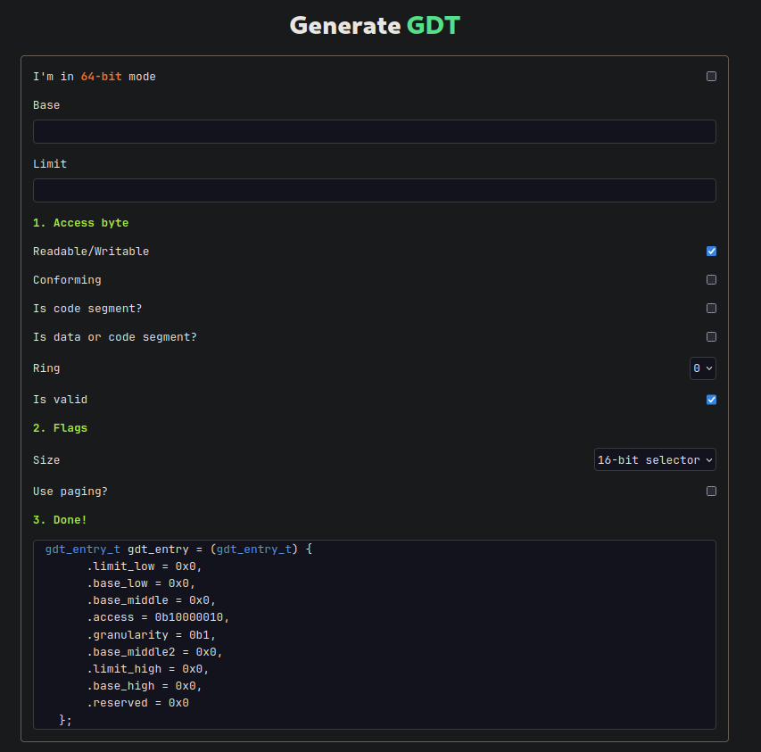

<h1 style="text-align:center">GDT Generator</h1>

  <strong>Generate GDT or IDT table entries for your OS! ✨</strong>
   
  <a href="https://gdt.7f454c46.xyz/">Now available here!</a>

## Building

Built as an example project with Astro.

### Running locally

1) Clone the repo
2) `npm install` or `bun install` (or whatever you're using)
3) `bun run dev`

## Licensing

License under MIT, see [LICENSE](LICENSE) for more information.